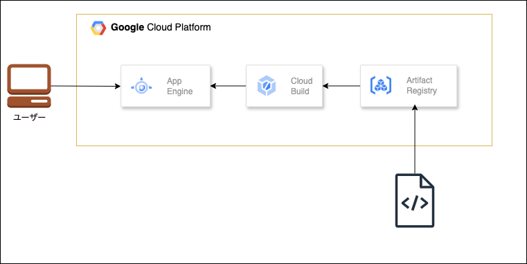

# Flask App on Google Cloud App Engine with Terraform

<p align="center">
  
</p>


# 概要
このプロジェクトは、Terraformを使用してFlaskアプリをGoogle Cloud Platform (GCP)のApp Engineにデプロイするためのものです。App Engineの設定、リソースの管理をTerraformで行い、Google Cloudのサービスを効率的に管理します。

# 使用技術
+ Flask: 軽量なPython Webフレームワーク
+ Google Cloud App Engine: サーバーレスのアプリケーションホスティング
+ Terraform: インフラストラクチャのコード管理
+ Artifact Registry: コンテナイメージの保存
+ Cloud Build: 自動ビルドとデプロイメントの設定
+ IAM: アクセス管理
+ Cloud Storage: ファイルストレージ

# 使い方
+ terraform_applyを実行して、インフラを構築し、アプリケーションをデプロイします。
+ デプロイの削除はterraform_destroyを使用して行います。


# 起動方法

### 1. 環境ごとのtfvars作成

```
bin/make_tfvars
```

### 2. Terraform の適用

```
bin/terraform_apply
```

### 3. デプロイの確認

Terraformの出力で示されたURLをブラウザで開き、Nginxのデフォルトページが表示されることを確認してください。

### 4. Terraform の削除

```
bin/terraform_destroy
```
